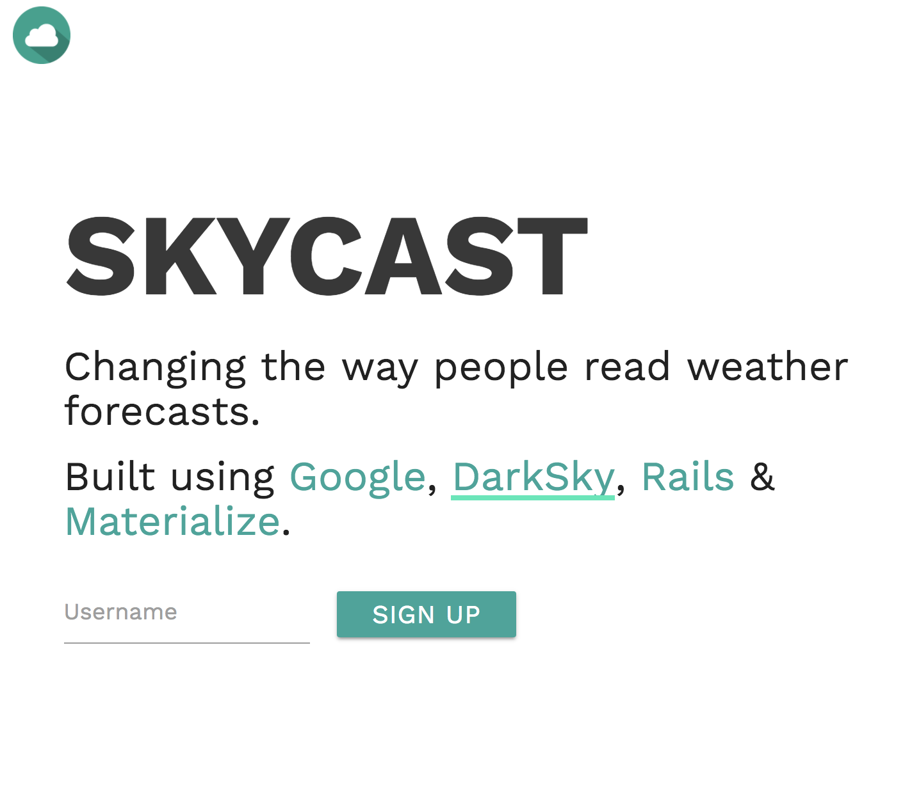

# Skycast

## [Hosted on Heroku](https://bwskycast.herokuapp.com/)


### Installation Notes


* Ruby version
 2.4.2

* Rails version
 5.1.4

To install Skycast locally, run `bundle install` in the root directory.

You will also need to add the following variables to an `.env` file:

```
GEOLOCATION_KEY=*your google maps api key*
WEATHER_KEY=*your https://darksky.net/dev/ api key*
```

### Future Goals

- Ability for users to add a location to their favorites
- Breaking up some of the the views into partials - could've been a little more dry
- Mobile design - the app is basically web-only.

### Credits

<dl>
<dt>Technologies</dt>
<dd>Skycast uses Rails, Google Maps, DarkSky and Materialize. It also uses Httparty to make these external API calls.</dd>
<dt>APIs</dt>
<dd>Weather data is served using the <a href='https://darksky.net/dev/'>Dark Sky API</a>. Geolocation data comes from the <a href='https://developers.google.com/maps/web-services/' target='_blank'>Google Web Services API</a>.</dd>

<dt>Styling/CSS</dt>
<dd>Materialize by Google was used as the CSS framework, together with about 250 lines of custom CSS. </dd>

<dt>Icons</dt>
<dd>Icons are from various both Materialize and Font Awesome (both gems).</dd>
</dl>
